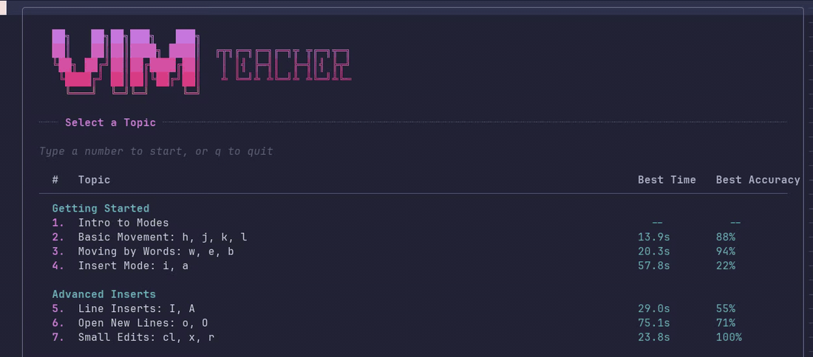

# VimTeacher

Interactive Vim tutorial plugin that teaches Vim concepts directly inside Neovim.



## Requirements

- Neovim >= 0.7 (tested on 0.11.6)

## Installation

### Quick Setup

Clone directly into Neovim's `pack/start` path:

```bash
git clone https://github.com/brentsec/VimTeacher.git ~/.local/share/nvim/site/pack/plugins/start/vim-teacher
```

Then open Neovim and run `:VimTeacher`.

### With lazy.nvim (LazyVim)

Add to `~/.config/nvim/lua/plugins/vimteacher.lua`:

```lua
return {
  dir = "/path/to/apps/vim-teacher",
  cmd = "VimTeacher",
}
```

### Manual

Symlink or copy to your Neovim pack path:

```bash
ln -s /path/to/apps/vim-teacher \
  ~/.local/share/nvim/site/pack/plugins/start/vim-teacher
```

## Usage

Open Neovim and run:

```
:VimTeacher
```

This opens the topic selection menu. Press a number to start a lesson.

To jump directly into a specific lesson:

```
:VimTeacher basic_movement
```

### During a Lesson

- Navigate with the keys being taught (e.g., h/j/k/l for basic movement)
- Move your cursor to the green highlighted target and stop on it
- Challenges auto-progress after each completion
- Complete 10 challenges to finish the lesson and view your session stats

| Key | Action |
|-----|--------|
| `q` | Return to topic menu (default) |
| `Q` | Restart current lesson (resets progress and stats) |

Note: lessons that teach macros remap menu to `m` so `q` can be used for recording.

### After Completing a Lesson

| Key | Action |
|-----|--------|
| `n` | Next topic |
| `p` | Previous topic |
| `r` | Restart current topic |
| `m` | Return to topic menu |
| `q` | Quit |

## Adaptive Keymapping

VimTeacher can detect your active Neovim keymaps at runtime and adapt lesson UI to show your mapped keys.

This is enabled by default:

```lua
require("vimteacher").setup({
  keymaps = {
    mode = "adaptive_display", -- strict | adaptive_display | adaptive_runtime
    distro = "auto", -- auto | neovim | lazyvim
    overrides = {}, -- optional: canonical_key -> display_key
  },
})
```

For full behavior and coverage details, see:
[Adaptive Keymapping Reference](docs/reference/adaptive-keymapping.md)

## Available Topics (40 lessons)

### Getting Started
1. Intro to Modes
2. Basic Movement: h, j, k, l
3. Moving by Words: w, e, b
4. Insert Mode: i, a

### Advanced Inserts
5. Line Inserts: I, A
6. Open New Lines: o, O
7. Small Edits: cl, x, r

### Essential Motions
8. Moving by WORDs: W, E, B
9. Line Boundaries: 0, $, _
10. Find Character: f, F, ;
11. Till Character: t, T, ;

### Basic Operators
12. Intro to Operators
13. Delete Words: dw, dW
14. Change Words: cw, cW
15. Delete Lines: dd, D
16. Multi-Line Delete: dj, dk
17. Copy & Paste: yy, p, P

### Advanced Vertical Movement
18. Line Jumps: 5j, 3k
19. Jump to Top/Bottom: gg, G
20. Paragraph Jumps: }, {
21. Scrolling: Ctrl+u, Ctrl+d

### Search
22. Search: /, n, N
23. Word Search: *, #
24. Search Review
25. Search & Replace: :s, :%s

### Text Objects: Brackets
26. Intro to Text Objects
27. Delete Inside: di(, di[, di{
28. Delete Around: da(, da[, da{
29. Change Inside: ci(, ci[, ci{
30. Change Around: ca(, ca[, ca{

### Text Objects: Quotes, Words & Paragraphs
31. Quote Objects: di", ci", da", ca"
32. Word Objects: diw, daw, ciw, caw
33. Paragraph Objects: dip, dap
34. Text Objects: Mega Review

### Editing Efficiency
35. Repeat Power: . and counts
36. Macros for Repetition: qa, q, @a, @@

### Visual Mode
37. Intro to Visual Mode
38. Visual Operators: v + d, v + c
39. Visual Line Mode: V + d, V + c
40. Switch Selection Ends: o

## Design Principles

### Dwell-Time Validation

All movement-based challenges require the cursor to **dwell** on the target position for 50ms before the challenge completes. This prevents users from holding down a movement key and flying past the target without intentionally stopping.

The dwell check is enforced centrally in `init.lua`'s `on_cursor_moved()` handler, so it applies to **all lessons automatically**. No per-lesson opt-in is needed. If a future lesson type genuinely doesn't need dwell validation (e.g., a timed command execution lesson), it can set `dwell_ms = 0` in its lesson table to bypass it.

### Neovim/LazyVim Support Notes

- VimTeacher targets Neovim (not classic Vim).
- Adaptive keymapping reads active mappings from your running Neovim session.
- LazyVim is supported through runtime detection and a late refresh on `User LazyVimStarted`.

## Adding New Lessons

1. Create `lua/vimteacher/lessons/your_lesson.lua` implementing the lesson interface:
   - `title` (string)
   - `description` (string[])
   - `hint_lines` (string[])
   - `generate_challenge(buf, ns_id)` (function returning `{snippet_lines, target, start_pos}`)
   - `compute_optimal(start_pos, target)` (optional, defaults to Manhattan distance)
   - `dwell_ms` (optional number, defaults to 50; set to 0 to disable dwell validation)
   - For adaptive text-heavy lessons, prefer `lua/vimteacher/lessons/base.lua` and define `*_template` fields instead of duplicating `get_title` / `get_description` / `get_hint_lines` boilerplate
2. Add `"your_lesson"` to the `M.order` table in `lua/vimteacher/lessons/init.lua`
3. Dwell-time validation is applied automatically by the orchestrator — no lesson-level code needed

## Stats

Player stats are stored in `stdpath("data") .. "/vimteacher/stats.json"` (best times, averages, accuracy, speed).

## Testing

```bash
bash scripts/test.sh
```

Or with Docker:

```bash
docker build -t vimteacher . && docker run --rm vimteacher
```
